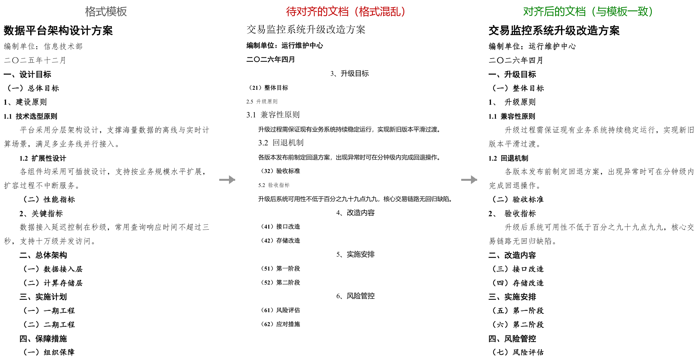

# doc-format-align

一键把 Word 文档的格式对齐到指定模板：标题编号、字体字号、行距缩进、页边距、页眉页脚页码、表格样式，全部以模板为准，正文内容保留，不会改动。

## 它能帮你做什么

- **套用模板格式**：把目标文档按照模板范本一键排版，不用手工逐段调格式
- **标题编号自动修正**：一、/（一）/1、各级编号按模板体系重排，自动编号与手动编号不会重复显示
- **正文格式统一**：字体、字号、行距、首行缩进全部对齐模板；文中的加粗强调原样保留
- **页码、页眉页脚一致**：纸张、页边距、页脚页码按模板统一
- **表格、目录自动套用**：表格套用模板样式，目录在 Word 里更新一下即可刷新
- **图片、列表、空行不破坏**：图片不会被裁剪、列表缩进不错乱、封面版式不撑爆
- **正文保护**：对齐前后逐段比对，正文文字零改动才会输出

## 使用效果

你只需要提供两样东西：

1. **目标文档**：要改格式的 Word 文档
2. **格式模板**：格式以它为准的 Word 文档

然后告诉 AI"把 XX 按 XX 模板对齐格式"即可。AI 会自动识别文档里的标题层级和正文，按模板完成排版。全程不需要打开 Word 手工调整，秒级完成。

## 安装

把 `doc-format-align` 目录放到你使用的 AI 工具的技能目录，例如：

- `~/.agents/skills/doc-format-align/`（跨工具通用）

安装后即可用自然语言触发，无需额外配置。

## 环境依赖

- 需要 **Python 3.8 或更高版本**
- 仅使用 Python 标准库，**无需安装任何第三方包**
- 不需要安装 Word 或 Office，纯文件级处理

## 注意事项

- 支持 `.docx` 格式；`.doc` 旧格式请先用 Word 另存为 `.docx`
- 对齐是纯格式操作，不需要 Word 自动化
- 封面分页、图片渲染等最终效果，建议用 Word 打开核对一眼
- 只保留对齐后的结果文件，中间产物自动清理
